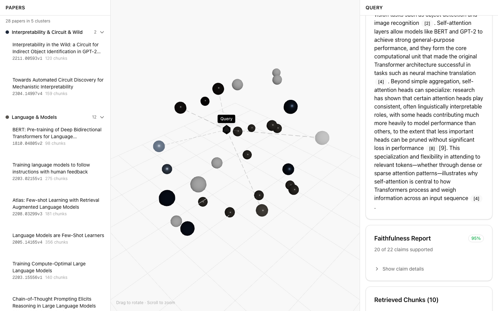
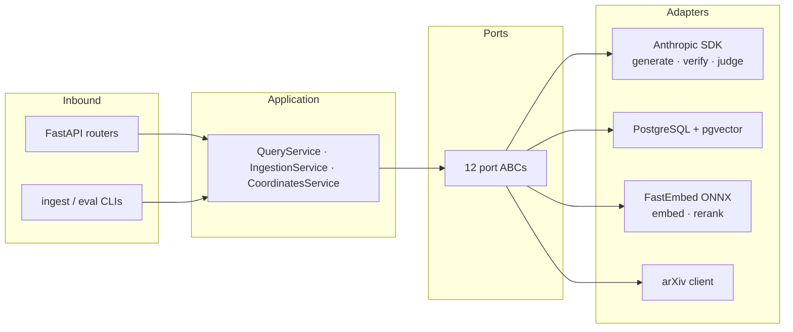
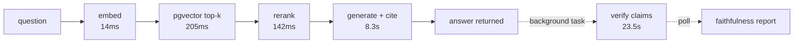

# ExplainRAG

[](https://github.com/smz-exe/explain-rag/actions/workflows/ci.yml)

Explainable Retrieval-Augmented Generation over arXiv papers. Every answer carries inline citations, a claim-level faithfulness report, and a per-stage timing trace; the corpus itself is browsable as a 3D map.

**Live demo:** <https://explain-rag.vercel.app>



## Features

- **Cited answers** — bracket citations map every claim in the answer to the retrieved chunks it came from
- **Claim-level faithfulness verification** — the answer is decomposed into claims and each is checked against the retrieved context, with verdict, evidence chunks, and reasoning. Verification runs as a background task, so the answer returns in ~8s instead of ~34s and the report fills in while you read
- **Cross-encoder reranking** — optional; each chunk displays its vector rank next to its reranked rank
- **Research Atlas** — UMAP + HDBSCAN projection of all paper embeddings into 3D; queries are projected into the same space with connections to the retrieved papers
- **Timing trace** — measured latency for every pipeline stage


## Architecture

Hexagonal (ports & adapters). The domain and application layers import no SDKs; every external system sits behind a port ABC and is injected in `main.py`.



Query pipeline, with measured median latencies (28-question harness run):



Verification dominates end-to-end latency, so it is deferred: the API responds after generation with `faithfulness_status: "pending"` and the client polls `GET /query/{id}/faithfulness`.

## Evaluation

`app/eval/` contains a quality harness: a committed 28-question set generated one-per-paper from abstracts, so each question has its source paper as retrieval ground truth by construction — no LLM judge in the retrieval metrics. Committed results: source-paper hit rate 0.82 @ top-10; reranking improves hit@1 from 0.46 to 0.61 within the retrieved window. Method and caveats: [app/eval/README.md](app/eval/README.md).

## Stack

| Layer | Technology |
|---|---|
| Backend | Python 3.12, FastAPI, anthropic SDK (Claude), FastEmbed (ONNX), asyncpg + pgvector |
| Frontend | Next.js 16, TypeScript, Tailwind, shadcn/ui, Three.js, orval-generated API client |
| Data | Supabase (PostgreSQL + pgvector), arXiv API |
| Deploy | Fly.io (API), Vercel (frontend), GitHub Actions CI/CD |

## Quality

- 292 backend tests with an enforced 80% coverage gate; mypy and ruff in CI
- 44 Playwright E2E checks (query flow, responsiveness, error handling, admin auth)
- Reproducible builds: Docker installs from `uv.lock`, the generated API client is committed, pnpm is pinned via `packageManager`
- CI deploys to Fly.io only after every gate passes

## Development

Requires a PostgreSQL database with pgvector (locally: `supabase start`) and the env vars in [app/.env.example](app/.env.example).

```bash
# backend (from app/)
uv sync --extra dev
uv run uvicorn src.main:app --reload --port 8000
uv run pytest tests/ --cov=src

# frontend (from frontend/)
pnpm install
pnpm dev
pnpm test:e2e
```

```
app/
  src/domain/        # entities + port ABCs (stdlib only)
  src/application/   # services
  src/adapters/      # inbound HTTP/CLI, outbound integrations
  eval/              # quality harness: question set, results, methodology
frontend/
  src/api/           # generated by orval (do not edit)
  src/components/    # UI
  e2e/               # Playwright specs
```
